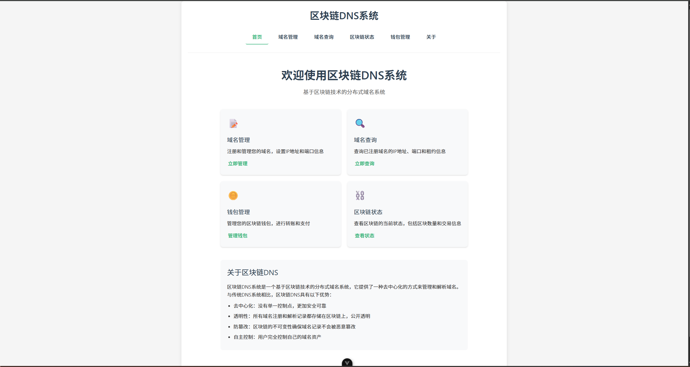
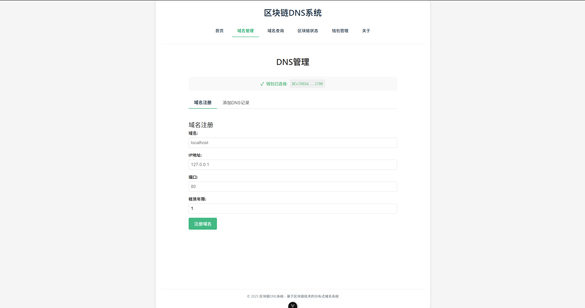
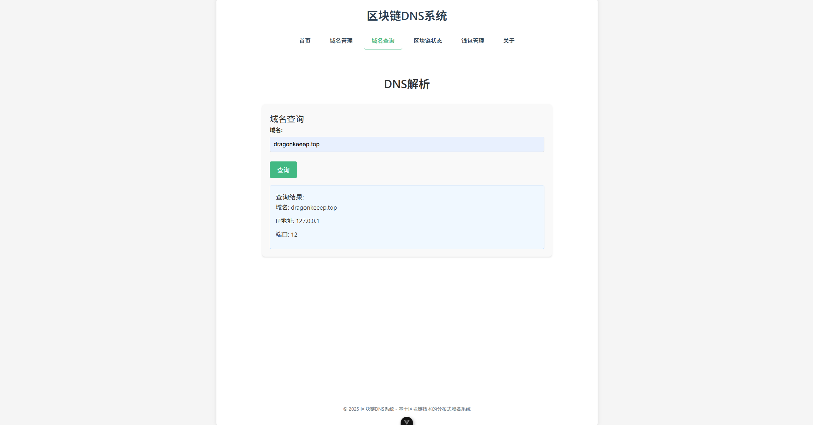
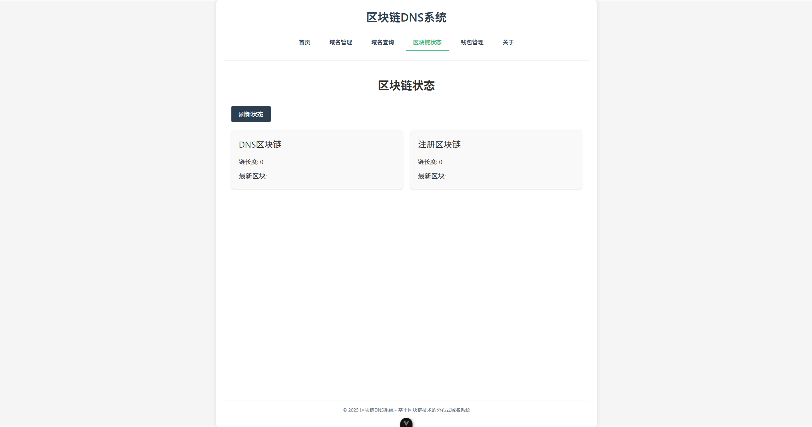

# 🌐 DNS 区块链系统
欢迎使用我们的 DNS 区块链系统！这个项目结合了区块链技术与 DNS 服务，提供去中心化的域名注册和解析功能。

## 📦 项目结构
- api.py ：提供 API 接口，用于域名注册、DNS 记录添加等操作。
- blockchain.py ：实现区块链的基本功能。
- blockwallet.py ：管理钱包和代币。
- dns.py ：处理 DNS 相关逻辑。
- Vue/ ：前端代码，使用 Vue.js 构建。
## 🚀 快速开始
1. 克隆仓库 ：
    git clone https://github.com/dragonkeep/DNS_BlockChain.git
2. 安装依赖 ：
   npm install 
3. 启动服务 ：
   npm run dev 
   python server.py -p 5137
## 🔑 功能
- 域名注册 ：通过钱包地址注册域名。
- DNS 记录管理 ：添加、删除和查询 DNS 记录。
- 区块链浏览 ：查看区块链状态和交易记录。
## 📄 UI展示

## 🤝 贡献
感谢使用我们的 DNS 区块链系统！希望您喜欢这个项目。